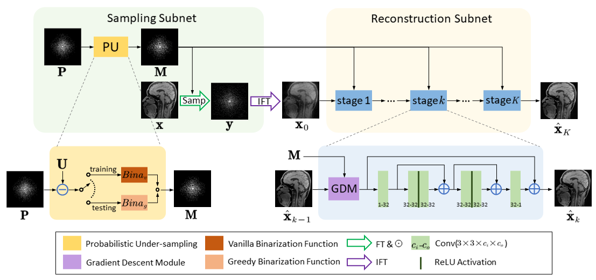
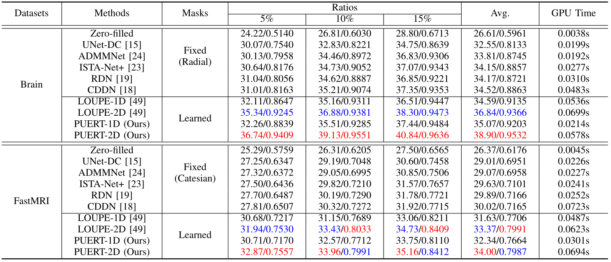
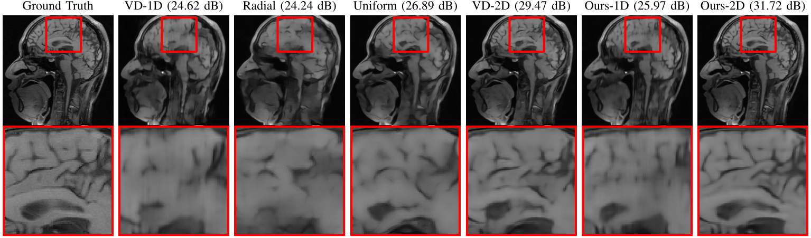

# PUERT: Probabilistic Under-sampling and Explicable Reconstruction Network for CS-MRI [PyTorch]

This repository is for PUERT introduced in the following paper

Jingfen Xie, [Jian Zhang](http://jianzhang.tech/), Yongbing Zhang and Xiangyang Ji. PUERT: Probabilistic Under-sampling and Explicable Reconstruction Network for CS-MRI. IEEE Journal of Selected Topics in Signal Processing. [PDF](https://ieeexplore.ieee.org/document/9764377)

The code is built on **PyTorch** and tested on Ubuntu 18.04 environment (Python 3.6.9, PyTorch 1.4.0) with NVIDIA Tesla V100 GPU.

## Introduction

Compressed Sensing MRI (CS-MRI) aims at reconstructing de-aliased images from sub-Nyquist sampling $k$-space data to accelerate MR Imaging, thus presenting two basic issues, i.e., where to sample and how to reconstruct. To deal with both problems simultaneously, we propose a novel end-to-end Probabilistic Under-sampling and Explicable Reconstruction neTwork, dubbed PUERT, to jointly optimize the sampling pattern and the reconstruction network. Instead of learning a deterministic mask, the proposed sampling subnet explores an optimal probabilistic sub-sampling pattern, which describes independent Bernoulli random variables at each possible sampling point, thus retaining robustness and stochastics for a more reliable CS reconstruction. A dynamic gradient estimation strategy is further introduced to gradually approximate the binarization function in backward propagation, which efficiently preserves the gradient information and further improves the reconstruction quality. Moreover, in our reconstruction subnet, we adopt a model-based network design scheme with high efficiency and interpretability, which is shown to assist in further exploitation for the sampling subnet. Extensive experiments on two widely used MRI datasets demonstrate that our proposed PUERT not only achieves state-of-the-art results in terms of both quantitative metrics and visual quality but also yields a sub-sampling pattern and a reconstruction model that are both customized to training data.



Figure 1. Illustration of the proposed PUERT framework.

## Test

### Quick start

1. Three models under 10% ratio for Brain dataset have been put in './model': PUERT-2D, PUERT-1D and PUERTPlus-2D.

2. The 50 test image in Brain dataset are provided in './data/brain_test_50'

3. Run the following scripts to test the above three models.

   **You can use scripts in file 'TEST_scripts.sh' to produce results for our paper.**

   ```bash
   # test PUERT
   ## use our provided best model to test ratio 10 version 2D
   python test_PUERT.py  --cs_ratio 10 --flag_1D 0 --model_best 1 --saveimg 1
   ## use our provided best model to test ratio 10 version 1D
   python test_PUERT.py  --cs_ratio 10 --flag_1D 1 --model_best 1 --saveimg 1
   
   # test PUERTPlus
   ## use our provided best model to test ratio 10 version 2D
   python test_PUERTPlus.py  --cs_ratio 10 --flag_1D 0 --model_best 1 --saveimg 1
   ```


4. Check the results in './result'.


## Train-CS

1. Training data for Brain dataset contains 100 images, and is the same as ADMM-Net. To download, please refer to https://github.com/yangyan92/ADMM-CSNet. You can also download from [GoogleDrive](https://drive.google.com/file/d/1eucDGIgPA0REW5RB12N54yHytc-jCCgu/view?usp=sharing) or [BaiduPan[code:en2e]](https://pan.baidu.com/s/1OSK-MH6wHCGuGOUQ42e-Qg)

2. Run the following scripts to train models.

   **You can use scripts in file 'TRAIN_scripts.sh' to train models for our paper.**

    ```bash
   # train PUERT. choose the ratio, 1D or 2D
   python train_PUERT.py  --cs_ratio 10 --flag_1D 0
   python train_PUERT.py  --cs_ratio 10 --flag_1D 1
   
   # train PUERTPlus
   python train_PUERTPlus.py  --cs_ratio 10 --flag_1D 0
    ```


## Results

### Quantitative Results



### Visual Results



## Citation

If you find the code helpful in your resarch or work, please cite the following papers.

```
@article{xie2022puert,
  title={PUERT: Probabilistic Under-sampling and Explicable Reconstruction Network for CS-MRI},
  author={Xie, Jingfen and Zhang, Jian and Zhang, Yongbing and Ji, Xiangyang},
  journal={IEEE Journal of Selected Topics in Signal Processing},
  year={2022},
  publisher={IEEE}
}
```

## Acknowledgements
